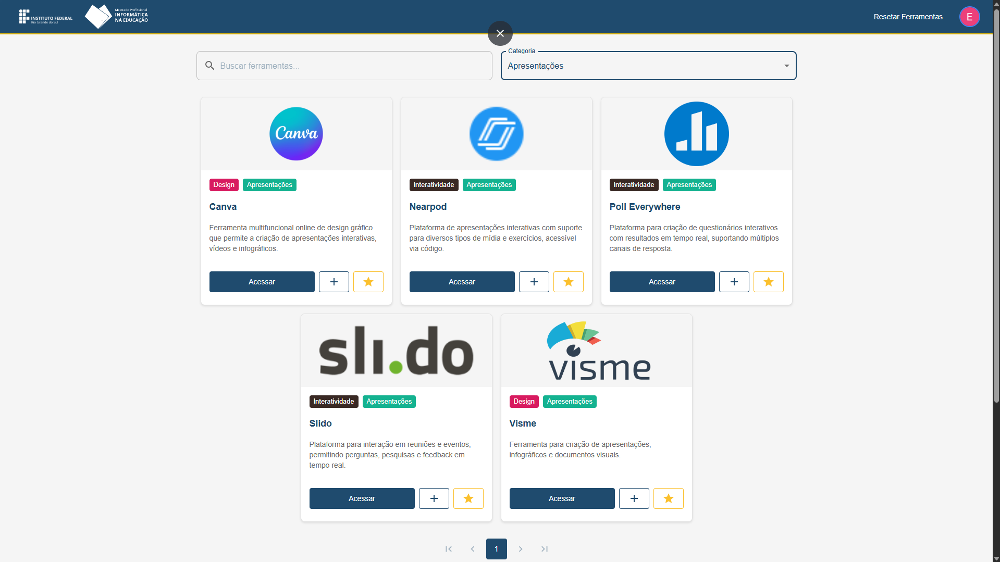

# Sistema Web para Curadoria de Ferramentas Educacionais

Este projeto faz parte do **Inovação Pedagógica na Educação Básica** (Edital INOVA EAD CAPES/2023) e tem como objetivo auxiliar professores da Educação Básica na busca e acesso a ferramentas tecnológicas digitais para uso em sala de aula. 

---

## 🏛️ Instituição

**Instituto Federal de Educação, Ciência e Tecnologia do Rio Grande do Sul**  
Campus Porto Alegre

---

## 👥 Colaboradores

### Coordenação
- **Carine Bueira Loureiro**

### Colaboradora
- **Silvia de Castro Bertagnolli**

### Desenvolvimento
- **Endrio Alberton Correa Nunes**  
  Contato: endrio.alberton@gmail.com

---

## 📚 Contexto

O projeto surge a partir de três constatações:
1. **Necessidade de suporte aos professores** na pesquisa, seleção e avaliação de recursos digitais gratuitos, considerando a inserção de tecnologias como Chromebooks e quadros interativos nas escolas.
2. **Uso limitado das tecnologias digitais na educação**, focando no uso do artefato em si ao invés do processo de aprendizagem.
3. **Potencial das tecnologias gratuitas** quando alinhadas à intencionalidade pedagógica, possibilitando práticas pedagógicas autorais e inovadoras.

---

## 🎯 Objetivo

Desenvolver um sistema web que permita aos professores:
- Buscar ferramentas educacionais digitais.
- Acessar informações detalhadas sobre as ferramentas.
- Explorar possibilidades de uso pedagógico autoral.

---

## 🎯 Objetivos Específicos

- Projetar o sistema web.
- Desenvolver a interface e a programação do sistema.
- Melhorar a interface por meio de técnicas de design.
- Testar e validar o sistema com os integrantes do projeto **Inovação Pedagógica na Educação Básica**.

---

## 🛠️ Tecnologias Utilizadas

- **React**: Biblioteca JavaScript para criação de interfaces de usuário.
- **Material-UI**: Biblioteca de componentes React para um design moderno e responsivo.
- **TypeScript**: Superset do JavaScript que adiciona tipagem estática ao código.
- **Firebase**: Utilizado para armazenamento e sincronização de dados em tempo real, garantindo:
  - **Escalabilidade**: Suporte para crescimento do sistema sem necessidade de grandes alterações na infraestrutura.
  - **Facilidade de Integração**: Integração simples com React e suporte a autenticação e banco de dados em tempo real.

---

## 🔍 Funcionalidades

### Página Inicial
- Barra de busca para inserção de palavras-chave.
- Exibição de categorias para facilitar a busca.
- Sistema de avaliação das ferramentas.

### Resultados da Busca
- Lista de ferramentas que correspondem aos critérios de busca.
- Informações básicas como nome, descrição curta e imagem.
- Média de avaliações e número total de avaliações.
- Categorização por cores para fácil identificação.

### Detalhes da Ferramenta
- Informações detalhadas sobre a ferramenta.
- Aspectos relevantes e limitações.
- Link direto para acesso.
- Possibilidade de avaliar a ferramenta.

---

## 🚀 Fluxo de Trabalho

1. **Página Inicial**: O professor acessa a página inicial e pode:
   - Buscar ferramentas por palavras-chave
   - Filtrar por categorias
   - Ver avaliações das ferramentas

2. **Processamento da Busca**: A aplicação filtra a lista de ferramentas com base nos critérios selecionados.

3. **Visualização e Interação**: O professor pode:
   - Ver detalhes das ferramentas
   - Avaliar as ferramentas
   - Acessar diretamente as ferramentas
   - Filtrar por diferentes categorias

---

## 🖼️ Imagem do Sistema



> Interface principal do sistema mostrando a busca de ferramentas.

---

## 🔧 Como Executar o Projeto

1. Clone o repositório:
    ```bash
    git clone https://github.com/seu-usuario/nome-do-repositorio.git
    ```

2. Instale as dependências:
    ```bash
    npm install
    ```

3. Configure o Firebase:
   - Crie um projeto no [Firebase Console](https://console.firebase.google.com/).
   - Adicione as configurações do Firebase no arquivo `.env.local`:
     ```env
     REACT_APP_FIREBASE_API_KEY=SEU_API_KEY
     REACT_APP_FIREBASE_AUTH_DOMAIN=SEU_AUTH_DOMAIN
     REACT_APP_FIREBASE_PROJECT_ID=SEU_PROJECT_ID
     REACT_APP_FIREBASE_STORAGE_BUCKET=SEU_STORAGE_BUCKET
     REACT_APP_FIREBASE_MESSAGING_SENDER_ID=SEU_MESSAGING_SENDER_ID
     REACT_APP_FIREBASE_APP_ID=SEU_APP_ID
     ```

4. Inicie o servidor de desenvolvimento:
    ```bash
    npm start
    ```

---

## 📝 Licença

Este projeto está sob a licença MIT. Veja o arquivo [LICENSE](LICENSE) para mais detalhes.
